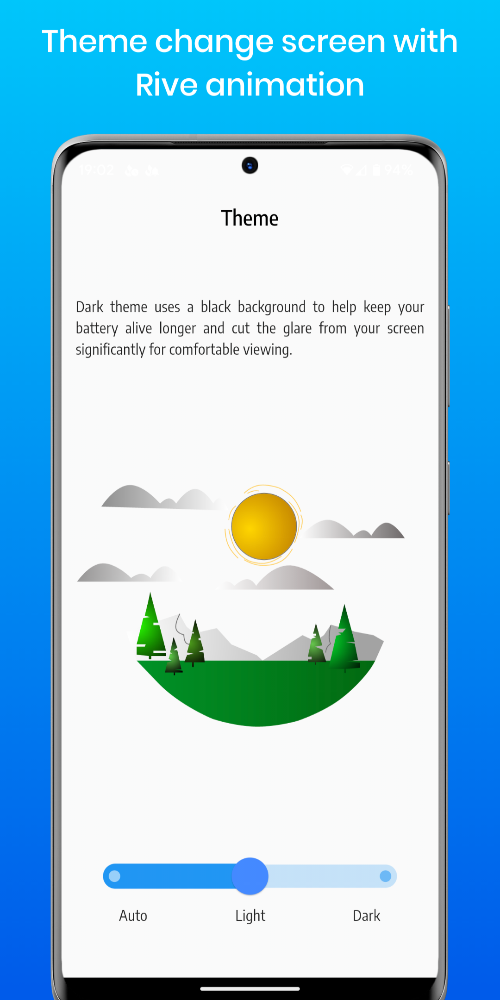
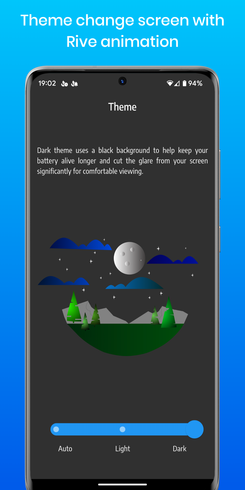

# Light/Dark screen with Rive animation

# Table of Contents
* [General Info](#general-information)
* [Technologies Used](#technologies-used)
* [Features](#features)
* [Screenshots](#screenshots)
* [Rive animation](#rive-animation)
* [Setup](#setup)
* [Acknowledgements](#acknowledgements)
* [Contact](#contact)
<!-- * [License](#license) -->

## General Information
- Change theme screen. It was created with Flutter. Animation made with Rive. All transition logic is provided with Rive's state machine.

## Technologies Used
- [Flutter](https://flutter.dev/?gclid=Cj0KCQjw1vSZBhDuARIsAKZlijRtxpWm4-4uONVZWImtjAFWLuNh3qXvWyRedL89vchIklx13I7zROwaAjR1EALw_wcB&gclsrc=aw.ds).
- [Dart](https://dart.dev/).
- [Provider](https://pub.dev/packages/provider) for state management.
- [Rive](https://rive.app/) for animation.

## Features
- Dark/Light/Auto theme.

## Screenshots
 

## Rive animation
Check my animation on [rive.app](https://rive.app/community/3338-7002-lightdark-theme).

## Setup
- Click on the green-colored Code button then copy the hyperlink. You may copy the link manually or by just click on the Copy icon.
- Open your Android Studio then go to the File > New > Project from Version Control.
- In the Version control choose Git from the drop-down menu.
- Then at last paste the link in the URL and choose your Directory. Click on the Clone button and you are done.

## Acknowledgements
- This project was based on [this tutorial](https://help.rive.app/).

## Contact
Created by [@Nexlay](https://twitter.com/Nexlay/) - feel free to contact me!

